# Fastcampus
## 퍼포먼스 마케터를 위한 업무자동화 실전 CAMP
### Day4. Google Apps Script

---
<!--
page_number: true
$size: A4
footer : fastcampus 퍼포먼스 마케터를 위한 업무자동화 실전 CAMP, Wooyoung Choi, 2018
-->

## Index
- Google Apps Script
	- Custom function
	- send mail via MailApp
	- Get Values from sheets
	- Add Scheduler
- Adwords Script
	- top 10 impressed keywords
	- pause 0 keywords

---
## Get Sheets from here!

https://docs.google.com/spreadsheets/d/1zd_RQskv8lBs9SibiHisOhveSOMXc8_rMBb3BTEIjZ0/edit?usp=sharing

---
## Homework Review
```javaScript
function fastCampus(num){
	if (num%15==0){
		return "fastcampus";
    } else if (num%3==0){
		return "fast";
    } else if (num%5==0){
		return "campus";
    } else {
		return num;
    }
}
```

---
## Homework Review
```javaScript
function doFastCampus(num){
	for (i=1;i<=num;i++){
		if (i%15==0){
			console.log("fastcampus");
	    } else if (i%3==0){
			console.log("fast");
	    } else if (i%5==0){
			console.log("campus");
	    } else {
			console.log(i);
	    }
	}
}

```

---
## Google Apps Script


---
## Google Apps Script

- javaScript을 기반으로 한 스크립트 언어
- Google Docs, Sheets, Slides, Forms 등의 G Suite 제품군의 사용자 정의 기능을 추가할 수 있음
- 스크립트 에디터를 내장하여 추가 프로그램이 필요없고, 구글의 서버에서 동작하므로 환경설정에 어려움이 없음

---
## Let's start with Script Editor

---
## Tools -> Script editor

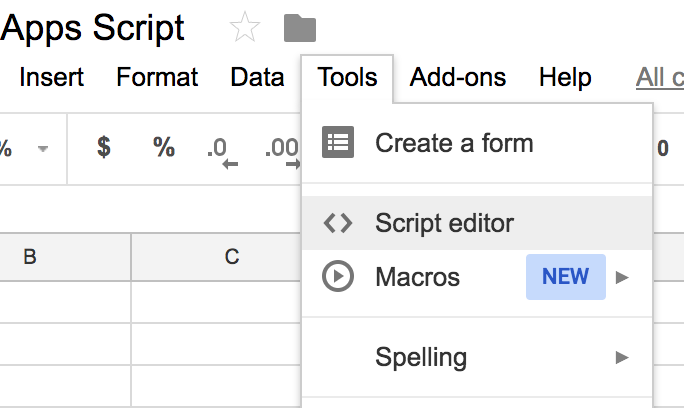

---
## Layout

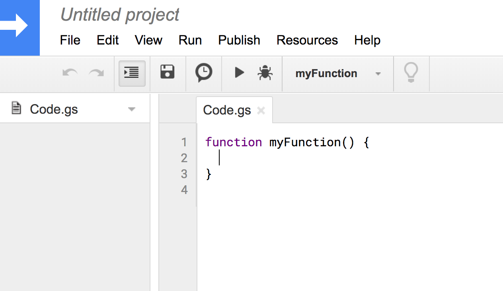

---
## Try "Hello Apps Script!"
```javascript
function sayhello(){
	return "Hello Apps Script!"
}
```

---
## Make vatCalculator
- 세전가격: 10000, 부가세율: 10% -> 소비자가격: 11000
- 소비자가격: 11000, 부가세율 10% -> 세전가격: 10000

---
## vatCalculator
```javascript
function vatCalculator(price, flag){
  
  taxRate = 0.1;
  
  if (flag===true){
  // if flag is true, return value with vat  
    return price*(1+taxRate);
    
  } else if (flag===false){
  // if flag is false, return value original price without vat
    return price/(1+taxRate);
  }
}
```

---
## Send email with MailApp

---
## Send email with MailApp

```javascript
function sendMail(){
    var mailAddress = 'your email address';
    var mailContents = 'test mail success?';
    MailApp.sendEmail(mailAddress, 'Test mail', mailContents);
}
```

---
## Send email with MailApp

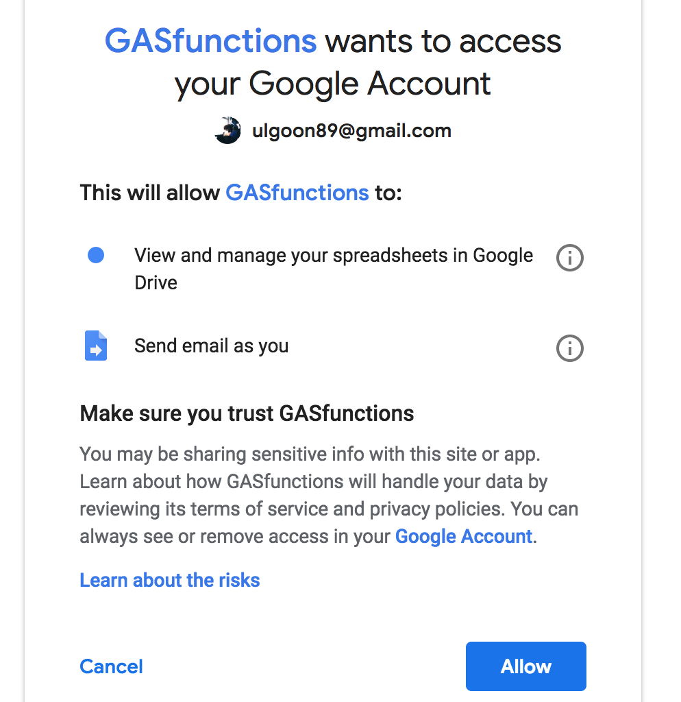

---
## Send Repetitive mails

```javascript
function sendSuggestion(){
  var sheet = SpreadsheetApp.openById('sheet id')
     .getSheetByName('MailPractice');
  var dataRange = sheet.getRange(2, 2, 2, 3);
  var data = dataRange.getValues();
  
  for (var i=0;i<data.length;i++){
    var message = sheet.getRange("A2").getValue();
    var mailAddress = data[i][0];
    var name = data[i][1];
    var greeting = '안녕하세요 ' + name + '님\n';
    var content = greeting + message;
    Logger.log(name);
    Logger.log(mailAddress);
    Logger.log(content);
    
    var progress = data[i][2];
    if (progress != "Sent"){
      MailApp.sendEmail(mailAddress, greeting, content);
      sheet.getRange(2+i, 2+2).setValue("Sent");
      SpreadsheetApp.flush();
    }
  }
}
```

---
## Did it work?

---
## Get values from sheets

```javascript
var dashboard = SpreadsheetApp.openById('sheet id')
   .getSheetByName('sheet name');
var nameRange = dashboard.getRange(2, 1, 22, 1);
var dataRange = dashboard.getRange(2, 10, 22, 1);
var names = nameRange.getValues();
var data = dataRange.getValues();
for (i=0;i<names.length;i++){
   Logger.log(names[i][0], data[i][0]);
}
```

---
## mail daily report
- Send email with MailApp + Get Values from shees

---
## Answer
```javaScript
function dailyReport(){
  var mailAddress = 'mail address';
  
  var dashboard = SpreadsheetApp.openById('sheet id')
      .getSheetByName('sheet name');
  var nameRange = dashboard.getRange(2, 1, 22, 1);
  var dataRange = dashboard.getRange(2, 10, 22, 1);
  var names = nameRange.getValues();
  var data = dataRange.getValues();

  var mailContents = 'Daily Report\n 섹터별 daily CPA\n';
  
  for (i=0;i<names.length;i++){
    mailContents = mailContents + 
    names[i][0] + 
    ": " + 
    data[i][0] + "\n";
    Logger.log(mailContents);
  }
  MailApp.sendEmail(mailAddress, 'Daily Report', mailContents);
}
```

---
## Add Scheduler in Google Apps Script

---
## Add Scheduler in Google Apps Script
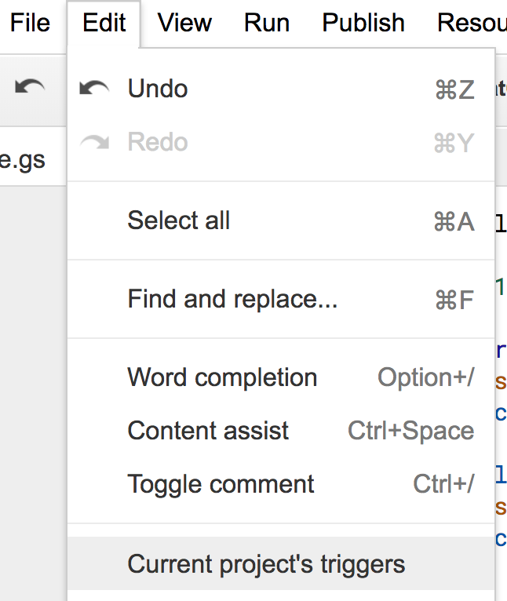

---
## Add Scheduler in Google Apps Script
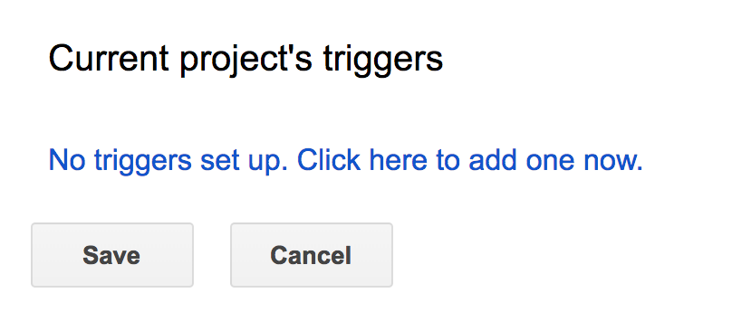

---
## Add Scheduler in Google Apps Script
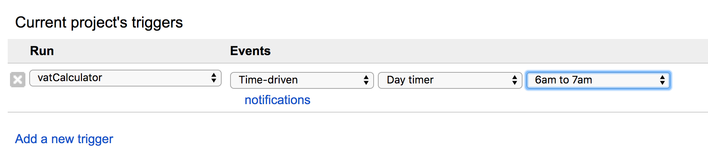

---
## Add Scheduler in Google Apps Script
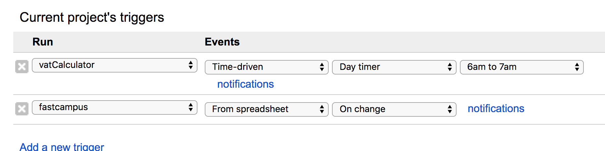

---
## Ads Customize

---
## Google Adwords to Google Ads


---
## Start Ads Script
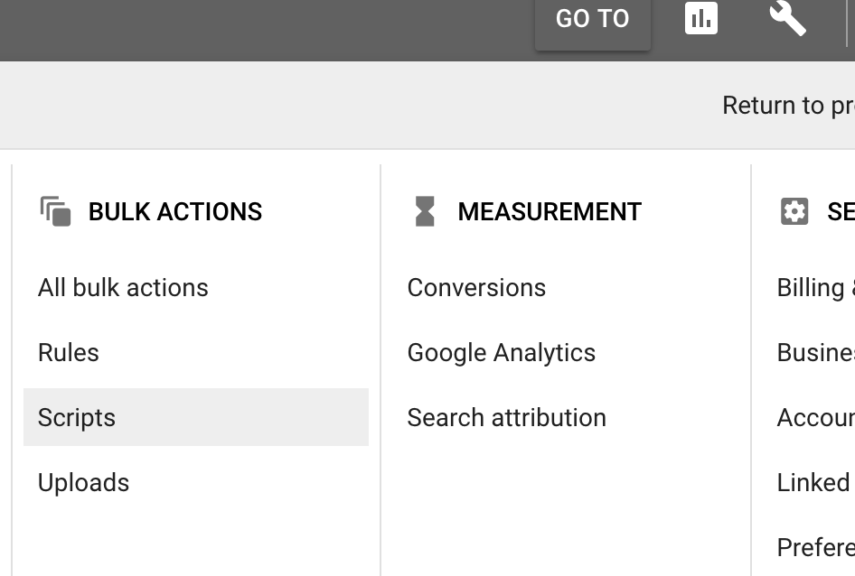


---
## Start Ads Script
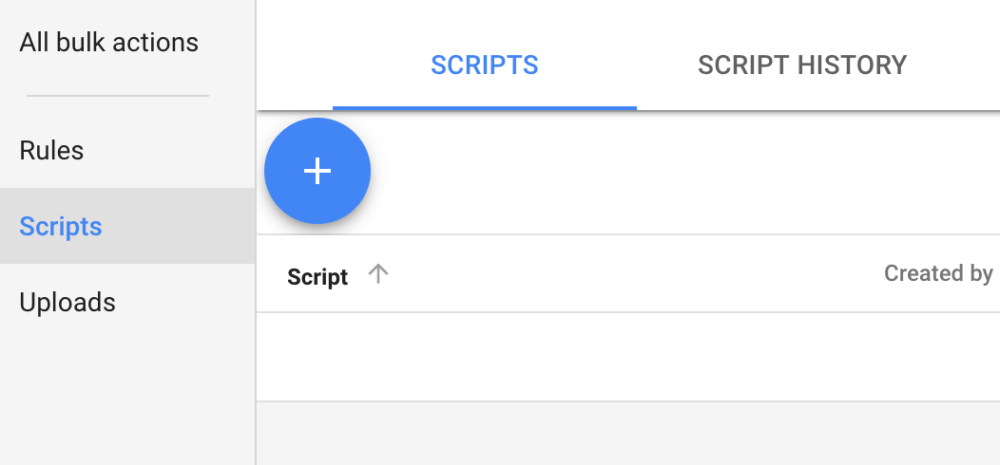


---
## Start Ads Script
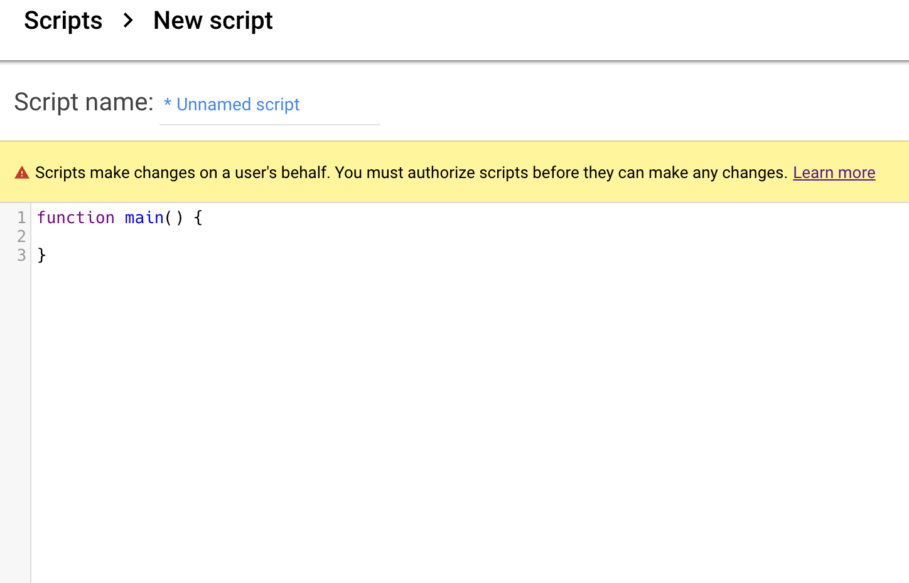


---
## Start Ads Script
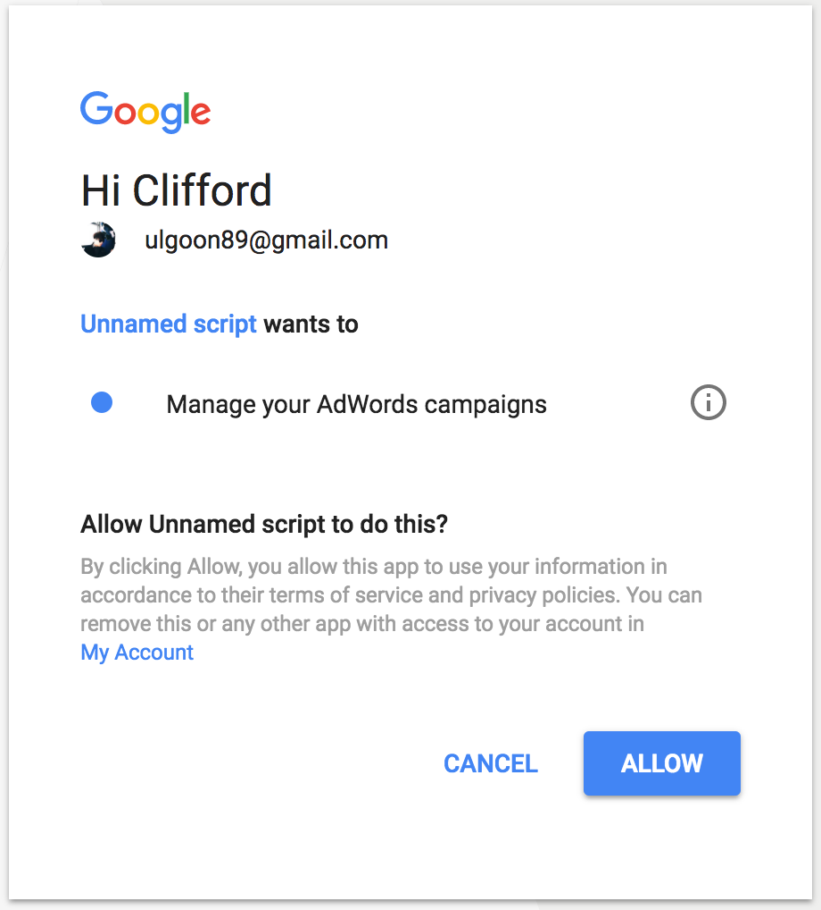


---
## Start Ads Script


---
## 10 keywords with most impressions yesterday

```javaScript
function main() {
  var keywords = AdWordsApp.keywords()
      .orderBy("Impressions DESC")
      .forDateRange("YESTERDAY")
      .withLimit(10)
      .get();

  Logger.log("10 keywords with most impressions yesterday");
  while (keywords.hasNext()) {
    var keyword = keywords.next();
    Logger.log(keyword.getText() + ": " +
        keyword.getStatsFor("YESTERDAY").getImpressions());
  }
}
```


---
## See result!
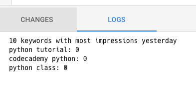


---
## Pause Keywords

```javaScript
var TO_NOTIFY = "your@email.com";
function main() {
  
  var kwIter = AdWordsApp.keywords()
    .withCondition("Impressions = 0") 
    .forDateRange("ALL_TIME") 
    .withCondition("Status = ENABLED")
    .withCondition("CampaignStatus = ENABLED")
    .withCondition("AdGroupStatus = ENABLED")
    .get();
    
  var toPause = [];
```

---
## Pause Keywords

```javaScript    
  while (kwIter.hasNext()) {
    var kw = kwIter.next();
    toPause.push(kw);
    
    if(AdWordsApp.getExecutionInfo().isPreview() &&
       AdWordsApp.getExecutionInfo().getRemainingTime() < 10) {
      break;
    }
  }
   
  for(var i in toPause) {
    toPause[i].pause();
  }
```

---
## Pause Keywords

```javaScript 

  MailApp.sendEmail(TO_NOTIFY, 
                    "AdWords Script Paused "
                    +toPause.length
                    +" Keywords.", 
                    "Your AdWords Script paused "
                    +toPause.length
                    +" keywords.");
}
```


<link href="https://fonts.googleapis.com/css?family=Nanum+Gothic:400,800" rel="stylesheet">
<link rel='stylesheet' href='//cdn.jsdelivr.net/npm/hack-font@3.3.0/build/web/hack-subset.css'>

<style>
h1,h2,h3,h4,h5,h6,
p,li, dd {
font-family: 'Nanum Gothic', Gothic;
}
span, pre {
font-family: Hack, monospace;
}
</style>