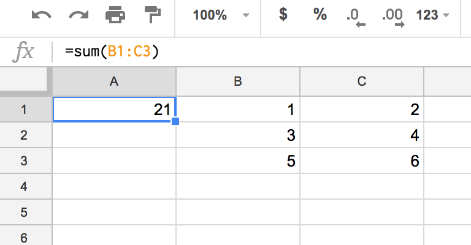

# Fastcampus
## 퍼포먼스 마케터를 위한 업무자동화 실전 CAMP
### Additional Infos

---
<!--
page_number: true
$size: A4
footer : fastcampus 퍼포먼스 마케터를 위한 업무자동화 실전 CAMP, Wooyoung Choi, 2018
-->

---
## 대시보드 CPA Watching script 구현하기

```javascript
function watchCPAHourly(){
  // open sheet
  var sheetID = '1zd_RQskv8lBs9SibiHisOhveSOMXc8_rMBb3BTEIjZ0';
  var sheet = SpreadsheetApp.openById(sheetID).getSheetByName('dashboard');
```
---
```javascript

  // get real CPA data
  var dataRange = sheet.getRange(2, 10, 22, 1);
  var dataCPA = dataRange.getValues();
  
  // get CPA Goal data
  var goalRange = sheet.getRange(2, 11, 22, 1);
  var dataGoal = goalRange.getValues();
  
  // declare to store results
  var results = [];
```
---
```javascript  
  // find data and store to results
  for(i=0;i<dataCPA.length;i++){
    if(Number(dataCPA[i])>Number(dataGoal[i])*1.1){
      //find category name
      var tempName = sheet.getRange(i+2, 1).getValue();
      //store to results
      results.push([tempName, dataCPA[i][0], dataGoal[i][0]]);
    }
  }
  ```
---
```javascript
  if (results.length > 0){
  // Set results to String
  var resultString = "";
  // in the results, get 1 element
  for(i=0;i<results.length;i++){
    // for 1 element, concat each data into resultString 
    for(j=0;j<results[i].length;j++){
      resultString += results[i][j];
      // add delimiter
      resultString += ",";
    }
    // add new line
    resultString += "\n";
  }
  //mail to Marketer
  var SEND_TO = 'me@ulgoon.com';
  var timeStamp = Utilities.formatDate(new Date(), "GMT+09", "yyyy-MM-dd'T'HH:mm:ss'Z'");
  var title = "CPA Warning!!("+ timeStamp +")";
  var resultString = "CPA Warning!!" + "\n" + 
    timeStamp + "\n" + resultString;
  
  MailApp.sendEmail(SEND_TO, title, resultString);
  return true;
  } else{
    return false;
  }
}
```
---
```javascript
function watchCPAHourly(){
  // open sheet
  var sheetID = '1zd_RQskv8lBs9SibiHisOhveSOMXc8_rMBb3BTEIjZ0';
  var sheet = SpreadsheetApp.openById(sheetID).getSheetByName('dashboard');
  
  // get real CPA data
  var dataRange = sheet.getRange(2, 10, 22, 1);
  var dataCPA = dataRange.getValues();
  
  // get CPA Goal data
  var goalRange = sheet.getRange(2, 11, 22, 1);
  var dataGoal = goalRange.getValues();
  
  // declare to store results
  var results = [];
  
  // find data and store to results
  for(i=0;i<dataCPA.length;i++){
    if(Number(dataCPA[i])>Number(dataGoal[i])*1.1){
      //find category name
      var tempName = sheet.getRange(i+2, 1).getValue();
      //store to results
      results.push([tempName, dataCPA[i][0], dataGoal[i][0]]);
    }
  }
  if (results.length > 0){
  // Set results to String
  var resultString = "";
  // in the results, get 1 element
  for(i=0;i<results.length;i++){
    // for 1 element, concat each data into resultString 
    for(j=0;j<results[i].length;j++){
      resultString += results[i][j];
      // add delimiter
      resultString += ",";
    }
    // add new line
    resultString += "\n";
  }
  
  //mail to Marketer
  var SEND_TO = 'me@ulgoon.com';
  var timeStamp = Utilities.formatDate(new Date(), "GMT+09", "yyyy-MM-dd'T'HH:mm:ss'Z'");
  var title = "CPA Warning!!("+ timeStamp +")";
  var resultString = "CPA Warning!!" + "\n" + 
    timeStamp + "\n" + resultString;
  
  MailApp.sendEmail(SEND_TO, title, resultString);
  return true;
  } else{
    return false;
  }
}
```

---
## 여기에 Scedule을 추가하면!!
- 주기적으로 값을 체크한 뒤, 값을 초과하는 카테고리만 메일로 받아볼 수 있습니다.
- 실시간으로 값을 체크하기엔 로드가 많이 걸리므로 10분 간격으로 주기적으로 함수를 실행하게 하면 됩니다!

---
## Script Editor에서 시트 내부함수 사용하기
```javascript
function nativeFunctionPractice(){
  var sheet = SpreadsheetApp
    .getActiveSpreadsheet()
    .getSheetByName('Sheet6');
  
  var testCell = sheet.getRange('A1');
  testCell.setFormula("=sum(B1:C3)");
}
```

---
## Result


<link href="https://fonts.googleapis.com/css?family=Nanum+Gothic:400,800" rel="stylesheet">
<link rel='stylesheet' href='//cdn.jsdelivr.net/npm/hack-font@3.3.0/build/web/hack-subset.css'>

<style>
h1,h2,h3,h4,h5,h6,
p,li, dd {
font-family: 'Nanum Gothic', Gothic;
}
span, pre {
font-family: Hack, monospace;
}
</style>